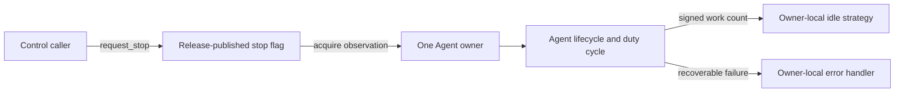

# Agent implementation plan

## Status

This is the maintained design and delivery record for the selected Agrona
Agent surface. The implementation and local Linux acceptance evidence are
complete, and the cross-platform evidence gate passed on native Linux x86_64,
Linux AArch64, macOS AArch64, and Windows x86_64.

The selected scope is fixed:

- the `Agent` lifecycle and duty-cycle contract;
- expected and unexpected termination;
- recoverable error reporting and optional in-process error counting;
- caller-driven invocation;
- dedicated-thread execution;
- static composition; and
- all seven Agrona idle strategies.

Shared-memory counters and controls remain deferred. CPU affinity, scheduling
priority, async runtimes, and forced thread cancellation are not part of this
increment. `DynamicCompositeAgent` and its cross-thread add/remove protocol
are not selected.

## Authority and evidence

The references have different authority:

1. Agrona Java commit
   `d4a47c67258f85b39910c4999da346ead655b736` is normative for observable
   lifecycle, error, cursor, control-slot, work-count, and idle behavior.
2. Aeron C commit
   `e44cd27a3b357c27ad37f6107a957f46d95552ac` is a native implementation
   comparison for thread ownership, cooperative shutdown, acquire/release
   stop publication, and idle primitives. It does not override Java.
3. `Agent.jl` commit
   `2e9f276fb6e7b573dda439a18f00aa80c0b3d69a` is an example only. Its task
   model, locks, safepoints, and API adaptations are not requirements or test
   oracles.
4. This reviewed Rust contract is authoritative only where Java mechanisms
   have no direct safe Rust equivalent. Such adaptations are called out
   explicitly below.

The main Java sources reviewed for this plan are `Agent`,
`AgentTerminationException`, `AgentInvoker`, `AgentRunner`,
`CompositeAgent`, `IdleStrategy`, and each concrete idle strategy. Their
corresponding Java tests define the initial behavioral test inventory.

### Aeron C applicability

The native Agent comparison is specifically:

- `aeron-client/src/main/c/aeron_agent.h`; and
- `aeron-client/src/main/c/aeron_agent.c`.

At the pinned Aeron revision these files support the following Rust design
choices:

| Aeron C behavior | Applicable Rust decision |
|---|---|
| `aeron_agent_runner_t` owns Agent state, idle state, callbacks, thread, and running state. | A runner owns one Agent and one idle strategy; lifecycle and duty-cycle calls remain serialized. |
| `agent_main` names the thread, calls start, then repeatedly calls `idle(do_work())`. | Preserve the same dedicated-thread loop shape and name it from `role_name`. |
| `aeron_agent_is_running` acquire-loads `running`. | The Rust worker acquire-loads its stop/running flag on every loop. |
| `aeron_agent_stop` release-stores `false` before joining. | `request_stop` release-publishes stop; join remains a separate waiting operation. |
| The C work loop contains no mutex and allocates nothing. | No mutex, channel, or allocation is permitted in the Rust steady-state runner loop. |
| C backoff uses the same not-idle, spin, yield, and park progression. | Use it to cross-check native spin/yield/park primitives and state ownership. |

Aeron C does not supply the Java invoker, composite, termination,
error-handler, or suppressed-error contracts, so it is not a reference for
those behaviors. Its idle defaults also differ at this revision—for example,
C uses 20 default yields while Java uses 5—so Java defaults and boundary
behavior remain normative. C invokes `on_close` only after stop and join,
whereas Java normally invokes it on the runner thread; the Rust callback
thread follows Java while retaining C's no-overlap ownership property.

## Required execution model

An Agent has one mutable owner. That owner serially invokes `on_start`,
`do_work`, and `on_close`; the crate never invokes two of those methods
concurrently for the same Agent.



The library supplies a closed-loop execution mechanism; it does not make an
Agent's individual `do_work` call bounded. Every Agent must return
periodically. If an Agent performs blocking I/O, the application must own a
separate wake or cancellation mechanism that makes shutdown bounded.

Busy-spin and no-op idling require a genuinely available CPU and an explicit
power budget. The crate will not imply that creating an OS thread reserves a
core, sets affinity, or establishes real-time scheduling.

## Compatibility ledger

### Behavior retained directly

- Lifecycle methods and duty cycles are called by one owner.
- Lifecycle callbacks default to no-op.
- Work counts are signed `i32`; positive means work, zero or negative means
  no work for idling.
- Ordinary duty-cycle errors are reported and the loop continues.
- Only ordinary duty-cycle errors increment the optional error counter.
- Expected termination is quiet and stops the Agent.
- Unexpected termination is reported, does not increment the counter, and
  stops the Agent.
- Startup and cleanup failures are reported but do not increment the counter.
- Invoker start and close are idempotent.
- Static composite startup and cleanup attempt all sub-agents and aggregate
  recoverable failures.
- A composite advances its cursor before invoking a sub-agent, so the next
  call resumes after a failing sub-agent.
- All Java idle aliases, defaults, transition boundaries, and reset behavior
  are retained.

### Required Rust adaptations

| Java mechanism | Rust contract |
|---|---|
| Checked and unchecked `Throwable` | Recoverable failures use explicit `Result`; panic remains a fatal programming failure. |
| `AgentTerminationException` | A distinct termination value retains the expected/unexpected bit and optional message/source. |
| `Thread.interrupt()` | Stop is cooperative. The runner release-publishes stop and unparks its worker, but cannot cancel arbitrary blocking code. |
| Shared-memory `AtomicCounter` | An optional process-local counter uses a Rust atomic and has no Agrona shared-memory layout. |
| Java `Thread` retains a runner object | Starting consumes the Rust runner and returns a handle; joining returns the owned Agent. |
| Java suppressed exceptions | A composite error owns the ordered list of recoverable sub-agent errors. |

### Unsupported Java states

Rust duration constructors will represent non-negative sleep durations.
Negative Java sleep values are not a supported Rust configuration. This is a
type-domain adaptation, not permission to change valid Java defaults,
transition boundaries, or ordering. Backoff must not add policy validation
such as requiring non-zero spin counts or `min <= max` unless a later API
review records that restriction explicitly.

## Proposed public contract

The names and signatures in this section are the P3 API proposal. They should
be reviewed before the first implementation pull request, but implementation
phases may not weaken the behavior above.

### Agent and failure types

The common error alias follows the conventional Rust name:

```rust
pub type BoxError =
    Box<dyn std::error::Error + Send + Sync + 'static>;
```

`Agent` is object-safe and mutable:

```rust
pub trait Agent: Send + 'static {
    fn role_name(&self) -> &str;

    fn on_start(&mut self) -> Result<(), BoxError> {
        Ok(())
    }

    fn do_work(&mut self) -> AgentResult;

    fn on_close(&mut self) -> Result<(), BoxError> {
        Ok(())
    }
}
```

`AgentResult<T = i32>` is a public alias for `Result<T, AgentError>`.
`AgentError` is a typed enum with exactly two semantic cases:

- `Failed(BoxError)` for a recoverable duty-cycle failure; and
- `Terminated(AgentTermination)` for expected or unexpected termination.

This makes termination explicit without allocating on a successful duty
cycle. `AgentTermination` implements `Error` so an unexpected termination can
be passed to the same error handler without changing its meaning.

`AgentError` implements `Display` and `Error`, exposes its source, provides a
`failed(error)` constructor for boxing a concrete error, and implements
`From<AgentTermination>`. It does not provide a blanket `From<E>` that would
conflict with Rust's `From<T> for T` implementation or obscure which failures
are termination.

`AgentTermination` has private state and named `expected` and `unexpected`
constructors plus `is_expected`. Operational failures are never represented
by strings alone, downcasting a boxed error is not required to detect
termination, and the public API does not depend on `anyhow`.

The Agent trait itself carries `Send` because the selected surface has one
uniform contract that can move into a runner. Mutable borrowing enforces
serial invocation after ownership transfer. `Sync` is not required.

### Error handling and counting

`ErrorHandler` is a mutable, owner-local callback:

```rust
pub trait ErrorHandler: Send + 'static {
    fn on_error(
        &mut self,
        error: &(dyn std::error::Error + Send + Sync + 'static),
    );
}
```

Closures implementing the equivalent `FnMut` signature should receive a
blanket implementation. Like Agrona's `ErrorHandler`, implementations must
not panic. A handler panic is fatal; it is not converted into another
recoverable Agent error.

`AgentErrorCounter` is optional and process-local. Increment and observation
use relaxed ordering because the count is diagnostic and does not publish
other data. It is an `i64` count with wrapping increment behavior, matching
Agrona's signed `long` arithmetic, but it does not imply Agrona counter layout
compatibility.

The normative handling matrix is:

| Origin | Report | Count | Continue duty cycles | Attempt close |
|---|---:|---:|---:|---:|
| `on_start` recoverable error | yes | no | no | yes |
| `do_work` recoverable error | yes | yes, if still running | yes | later |
| expected termination | no | no | no | yes |
| unexpected termination | yes | no | no | yes |
| `on_close` recoverable error | yes | no | no | already attempted |
| panic in Agent, idle strategy, or handler | no conversion | no | no | runner attempts close |

All public operational failures use typed `Result` values. Constructors use
typed errors for invalid input; runner start errors retain the unstarted
runner and expose the underlying `io::Error`; and runner join errors retain
the Agent and panic payload. Error types implement `Debug`, `Display`, and
`Error` where their fields permit it, expose `source`, and provide
`into_parts` or equivalent ownership-recovery methods. Panics are reserved
for violated programmer invariants and fatal unwinding, not normal lifecycle
conditions.

### AgentInvoker

`AgentInvoker<A, H>` owns its Agent and handler and is deliberately neither
`Sync` nor internally locked. It provides:

- `new`;
- `start(&mut self)`;
- `invoke(&mut self) -> i32`;
- `is_started`, `is_running`, and `is_closed`;
- idempotent `close(&mut self)`; and
- `into_agent(self)` after close.

`start` marks startup attempted before invoking `on_start`. A startup error is
reported and closes the invoker. `invoke` returns zero when not running or
when an error or termination was handled. An ordinary error leaves it
running. Termination closes it.

Rust has no caller-thread interruption flag equivalent to Java's
`Thread.interrupted` protocol. Invoker shutdown is therefore explicit through
termination or `close`; no synthetic interruption state will be introduced.
A panic unwinds to the caller and is not converted to `AgentError`.

### AgentRunner

`AgentRunner<A, I, H>` is an unstarted value that owns the Agent, one idle
strategy, the error handler, and the optional counter. Starting consumes it
and returns `AgentRunnerHandle<A>`. Consuming start provides start-once
semantics through ownership rather than a reusable state machine. The worker
OS thread is named from the Agent role before `on_start`.

The start operation must preserve the complete unstarted runner on OS thread
creation failure. The preferred safe design is a bootstrap thread plus a
zero-capacity ownership-transfer channel:

1. create the bootstrap channel;
2. spawn a thread that initially owns only the receiver;
3. if spawn fails, return the untouched runner with the `io::Error`;
4. if spawn succeeds, transfer the runner state to the worker; and
5. call `on_start` only after transfer on the worker thread.

The channel exists only during startup and is never touched by the work loop.
Its internal blocking does not change a reference lock-free hot path.

`AgentRunnerHandle` provides:

- `request_stop(&self)`, which never waits;
- `is_running`, `is_closed`, and `is_finished`;
- access to the worker `Thread` for diagnostics and unparking;
- `join(self)`, which waits for cleanup and returns the Agent;
- a Java-close-equivalent joining form with a retry interval and stall
  callback that continues waiting until termination; and
- a structured fatal result containing the Agent and panic payload when the
  worker caught a panic.

There is no API that times out and silently detaches a live Agent. A stall
callback may diagnose the worker or trigger an application-owned wakeup.
Dropping a live handle follows Rust's `JoinHandle` convention and detaches the
thread, so it must be documented as losing deterministic cleanup and must not
be used by crate examples.

Calling `request_stop` performs a release store and calls `Thread::unpark`.
Unparking bounds shutdown latency for park-based idle strategies. It does not
wake `thread::sleep` or arbitrary Agent I/O.

Closing an unstarted runner consumes it, calls `on_close` exactly once on the
calling thread, reports a recoverable cleanup error, and returns the Agent.

The worker catches panics at its outer boundary so it can attempt `on_close`
and return both the Agent and panic payload through join. It does not report a
panic as a recoverable error. If cleanup also panics, the structured fatal
result retains both payloads rather than discarding the first failure.

### CompositeAgent

`CompositeAgent` owns `Vec<Box<dyn Agent>>` and requires at least one
sub-agent. A single sub-agent is valid because the normative Java
implementation accepts it.

Its role name is constructed once as `[role-one,role-two]`. Startup and
cleanup collect recoverable errors in encounter order and attempt every
sub-agent. Panics are not collected, matching Java's distinction between
`Exception` and `Error`.

`do_work` increments its cursor before each call and uses `i32::wrapping_add`
for Java-compatible integer overflow. If a sub-agent returns an error, the
error is propagated and the cursor remains positioned at the following
sub-agent. The successful steady-state traversal performs no allocation.

### IdleStrategy and concrete strategies

`IdleStrategy` is mutable and owner-local:

```rust
pub trait IdleStrategy: Send + 'static {
    fn idle(&mut self, work_count: i32);
    fn idle_once(&mut self);
    fn reset(&mut self);
    fn alias(&self) -> &'static str;
}
```

The default `idle(work_count)` behavior is reset for positive work and one
idle step otherwise. A concrete strategy may override it where Java does.
Stateful strategies are not `Sync` and must not be shared between runners.

The seven implementations are:

| Component | Alias | Java defaults and exact behavior |
|---|---|---|
| `BackoffIdleStrategy` | `backoff` | 10 spins, 5 yields, 1,000 ns minimum park, 1,000,000 ns maximum park. Preserve the four states, pre-increment transition boundaries, first-idle behavior, positive-work reset, and capped doubling sequence. |
| `BusySpinIdleStrategy` | `spin` | `spin_loop` for zero/negative work; no-op for positive work. |
| `ControllableIdleStrategy` | `controllable` | Raw modes 0 not-controlled, 1 no-op, 2 spin, 3 yield, 4 park; not-controlled and unknown values park for 1,000 ns. |
| `NoOpIdleStrategy` | `noop` | No-op for both overloads and every work count. |
| `SleepingIdleStrategy` | `sleep-ns` | Default 1,000 ns; park for the configured duration for zero/negative work. |
| `SleepingMillisIdleStrategy` | `sleep-ms` | Default 1 ms; sleep for the configured duration for zero/negative work. |
| `YieldingIdleStrategy` | `yield` | `yield_now` for zero/negative work; no-op for positive work. |

A stateless Rust strategy can be a zero-sized value; a Java-style singleton is
not required. `ControllableIdleStrategy` is paired with a cloneable control
handle. The control stores the raw `i32` mode so unknown values retain Java's
park behavior; typed mode setters are convenience, not a restriction.

Backoff construction must not invent validation absent from Java. The
implementation must first record the supported Rust duration domain, then
prove that its sequence matches Java throughout that domain. Checked or
saturating arithmetic may be used only if the accepted configuration domain
makes it observationally identical to Java; it may not silently change a
reachable transition.

The exact backoff state trace is:

1. `NotIdle`: move to `Spinning` and increment the spin count without issuing
   a spin hint.
2. `Spinning`: issue a spin hint, pre-increment the spin count, and move to
   `Yielding` only when the count is greater than `max_spins`.
3. `Yielding`: pre-increment the yield count. If it is greater than
   `max_yields`, move to `Parking` and set the minimum park period without
   yielding or parking on that transition; otherwise yield once.
4. `Parking`: park for the current period, then double it and cap it at the
   configured maximum using arithmetic proven equivalent to Java in the
   supported domain.
5. Positive work resets spin count, yield count, park period, and state.

## Atomic and progress contract

The initial target profile requires native pointer-width and 64-bit atomics on
x86_64 and AArch64. Unsupported targets fail at compile time rather than
silently substituting a mutex.

| State | Writer ordering | Reader ordering | Reason |
|---|---|---|---|
| Runner stop/running flag | `Release` | `Acquire` | Publish shutdown from any controller to the owner loop, matching Java volatile and Aeron C. |
| Runner closed/state observation | `Release` | `Acquire` | Publish lifecycle completion to handle queries; `join` additionally supplies thread completion synchronization. |
| Controllable idle mode | `Release` | `Acquire` | Publish mode changes across threads, including ARM's weaker memory model. |
| Error count | `Relaxed` | `Relaxed` | Count is observational and does not guard other data. |
| Agent ID source | `Relaxed` RMW | none | Uniqueness only; no data publication. |

No crate-owned protocol currently requires `SeqCst`. Any change to weaker
orderings requires a specific happens-before argument and x86_64/AArch64
evidence.

The supported claims are deliberately narrow:

- Agent lifecycle and duty-cycle calls are single-owner and lock-free with
  respect to library coordination.
- `request_stop` is non-blocking and uses a bounded atomic publication plus
  unpark.
- No entire Agent loop is called wait-free: user `do_work`, OS scheduling,
  error handling, allocation before add submission, yield, park, and sleep
  are outside such a proof.

## Source and test layout

The Rust layout follows Agrona's one-public-component-per-file structure.
`mod.rs` contains documentation, declarations, and re-exports only.

```text
src/agent/
  mod.rs
  agent.rs
  agent_error.rs
  agent_result.rs
  agent_termination.rs
  box_error.rs
  error_handler.rs
  agent_error_counter.rs
  agent_invoker.rs
  agent_runner.rs
  agent_runner_handle.rs
  agent_runner_start_error.rs
  agent_runner_join_error.rs
  composite_agent.rs
  composite_agent_error.rs
  idle_strategy.rs
  backoff_idle_strategy.rs
  busy_spin_idle_strategy.rs
  controllable_idle_strategy.rs
  controllable_idle_strategy_mode.rs
  no_op_idle_strategy.rs
  sleeping_idle_strategy.rs
  sleeping_millis_idle_strategy.rs
  yielding_idle_strategy.rs
```

Private helpers may have private files when they own one protocol, for example
a runner outcome. No file will contain multiple idle-strategy
implementations.

Integration tests are also separated by component:

```text
tests/agent_contract.rs
tests/agent_invoker.rs
tests/agent_runner.rs
tests/agent_composite_agent.rs
tests/agent_backoff_idle_strategy.rs
tests/agent_busy_spin_idle_strategy.rs
tests/agent_controllable_idle_strategy.rs
tests/agent_no_op_idle_strategy.rs
tests/agent_sleeping_idle_strategy.rs
tests/agent_sleeping_millis_idle_strategy.rs
tests/agent_yielding_idle_strategy.rs
tests/agent_allocation.rs
tests/agent_liveness.rs
```

Small private unit tests may remain beside private helpers. Public behavior is
tested from separate files through the public API.

## Delivery slices

Each slice must preserve a green tree and include documentation and tests for
the public behavior it introduces.

### A0 — Approve the normative contract

- Review this API proposal against the pinned Java source and tests.
- Record the supported sleep/backoff duration domain.
- Add a requirement-to-test traceability ledger.

Exit evidence: every Java behavior has a retained, adapted, or explicitly
unsupported entry; no implementation-level question can change component
scope.

### A1 — Agent protocol and error foundation

- Implement `Agent`, boxed failure, termination, handler, and counter.
- Add reusable test Agents in test support only.
- Verify object safety, lifecycle defaults, work-count domain, expected flags,
  handler panic policy, and counter ordering.

Exit evidence: contract tests and documentation tests pass without a runner.

### A2 — AgentInvoker vertical slice

- Implement the caller-owned lifecycle and error matrix.
- Verify start once, close before/after start, repeated close, ordinary-error
  continuation, both termination modes, startup/cleanup errors, and panic
  propagation.
- Verify successful invocations allocate zero bytes after construction.

### A3 — AgentRunner vertical slice

- Implement ownership-preserving spawn, worker lifecycle, stop/unpark, join,
  stall diagnostics, panic capture, and Agent return.
- Test every lifecycle transition and errors from Agent, idle strategy, and
  handler.
- Exercise stop-before-worker-start, stop during every non-blocking idle
  state, close before start, and blocked-Agent diagnostics.
- Verify the loop has no mutex, channel, or allocation after startup.

### A4 — CompositeAgent vertical slice

- Implement exact role-name construction, lifecycle aggregation, wrapping
  work sum, and cursor recovery.
- Port the Java behavioral cases, including successive failures from
  different cursor positions.
- Verify successful traversal allocation behavior.

### A5 — Complete idle-strategy family

- Implement the common trait, then one strategy per source file.
- Use scripted hooks or private test instrumentation for deterministic
  backoff transition tests; wall-clock timing is not a correctness oracle.
- Verify aliases, defaults, positive/zero/negative work handling, reset, raw
  controllable modes, and unpark behavior.
- Compare the complete backoff state trace with Java-generated fixtures over
  boundary configurations in the supported domain.

### A6 — Acceptance, performance evidence, and documentation

- Run behavior, concurrency, liveness, allocation, and platform suites.
- Add closed-loop benchmarks for invoker, runner, composite traversal, and
  idle primitives.
- Record core availability, affinity, power assumptions, offered work, and
  duration for busy-spin/no-op benchmarks.
- Update README examples, `UPSTREAM.md`, and the evidence ledger.

The Agent gate closes only when A1-A6 and every idle strategy are complete.

## Verification plan

### Behavioral tests

Tests derived from Agrona Java must cover:

- exact lifecycle ordering and invocation counts;
- state visible inside callbacks;
- error reporting and counter rules;
- expected versus unexpected termination;
- composite aggregation order and cursor continuation;
- idle aliases, defaults, transition thresholds, and reset; and
- Java-compatible wrapping of composite work totals.

Java tests are evidence to translate, not code to copy. `Agent.jl` tests do
not establish edge behavior.

### Concurrency and liveness tests

- Race stop publication with an active worker on x86_64 and AArch64.
- Race controllable-mode changes with idle reads.
- Put external timeouts around every stress test.
- Model-check crate-owned atomic state protocols where practical.
- Run sanitizers or Miri for crate-owned unsafe code if any is introduced.

The tests must not rely only on sleep-based scheduling. Use barriers,
atomically published checkpoints, and bounded polling for deterministic
interleavings.

### Allocation and latency evidence

Allocator instrumentation verifies zero steady-state allocation for:

- successful invoker calls;
- successful runner duty cycles;
- static composite traversal;
- every idle step and reset.

Construction, thread creation, role-name assembly, recoverable error boxing,
and composite error aggregation are explicit control or exceptional-path
allocations.

Benchmarks are regression evidence, not a promise of Java-equivalent latency.
They must report median and tail distributions where the harness supports
them, avoid coordinated omission claims, and separate useful work from idle
cost.

### Repository and CI evidence

Every slice keeps these checks passing:

```text
cargo fmt --all --check
cargo test --workspace --all-targets --all-features
cargo clippy --workspace --all-targets --all-features -- -D warnings
RUSTDOCFLAGS="-D warnings" cargo doc --workspace --all-features --no-deps
```

Existing CI exercises stable Rust on Linux x86_64, Linux AArch64, macOS
AArch64, and Windows x86_64, plus Rust 1.85, coverage upload, Dependabot, and
documentation. Agent-specific liveness tests retain job-level and test-level
timeouts.

## Completion criteria

The Agent increment is complete only when:

- every selected component and all seven idle strategies are public and
  documented;
- every Java behavior is retained or has a reviewed Rust adaptation;
- the owner loop contains no mutex or steady-state channel operation;
- stop and controllable-mode publication work correctly on x86 and ARM memory
  models;
- cleanup is attempted exactly once on every non-abort runner lifecycle;
- ordinary errors, termination, and panics remain distinct;
- successful steady-state paths have measured zero allocation;
- CI, MSRV, Codecov, and Dependabot remain operational; and
- no shared-memory API or compatibility claim has entered scope.

## Risks and controls

| Risk | Control |
|---|---|
| Rust ergonomics accidentally changes Java lifecycle behavior | Maintain the compatibility ledger and derive tests from the pinned Java cases before implementation. |
| A mutex enters a reference lock-free path | Review the loop and controller implementation; use only owner-local mutation and audited atomic publication. |
| ARM exposes an ordering bug hidden on x86 | Require release/acquire protocols, Linux AArch64 CI, stress tests, and model checks where practical. |
| Forced-cancellation expectations cause shutdown hangs | Make stop cooperative, unpark park-based idle, expose stall diagnostics, and require application wakeups for blocking Agents. |
| Panic erases the original failure or skips cleanup | Catch only at the runner boundary, attempt cleanup once, and retain primary and cleanup panic payloads. |
| Backoff is “improved” away from Java behavior | Test exact state traces, defaults, and transition boundaries; do not add unapproved constructor policy. |
| Busy spinning is benchmarked on an oversubscribed host | Record placement and reservation assumptions and make no unsupported latency claim. |
| One file accumulates unrelated implementations | Enforce one public component per file and one behavioral integration-test file per component. |
