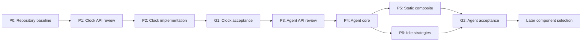
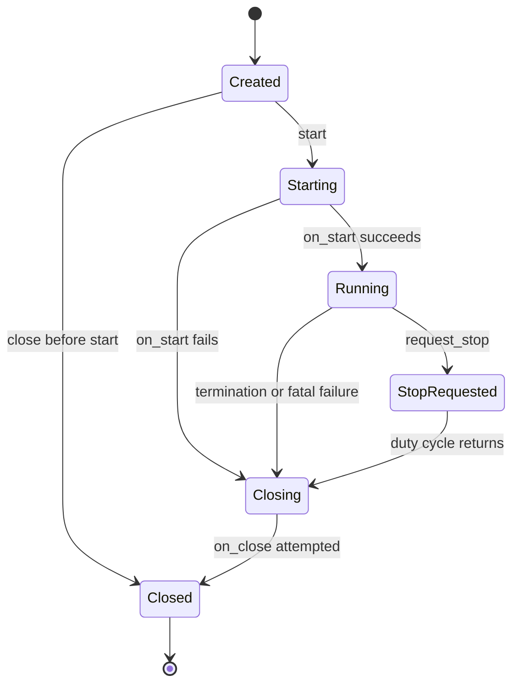

# agrona-rs initial delivery plan

> Maintainer design record. For package usage, see the
> [User Guide](../USER_GUIDE.md).

## Status and decision summary

agrona-rs is an unofficial, idiomatic Rust port of selected Agrona
low-latency building blocks. The Clock family and selected Agent family are
implemented. An Agrona-compatible counter-buffer reader and single-owner
counter infrastructure are selected as the first shared-memory increments.

This plan selects two initial component families:

1. **Clocks** are the first implementation increment.
2. **Agents and all Agrona idle strategies** are the second implementation
   increment.

The completed Clocks increment includes epoch, monotonic, system, cached, and
offset epoch clocks. The Agent increment includes the Agent protocol, runner,
invoker, static composite, termination and error behavior, and all seven
Agrona idle strategies. `DynamicCompositeAgent` is not selected.

Snowflake IDs are not selected for a port. Existing Rust implementations must
be evaluated first. Shared-memory facilities remain deferred except for the
selected counter-buffer infrastructure described by `DEC-COUNTER-001`.

The selected components passed the initial G1-G5 review recorded below and
their public API reviews are closed. Clock implementation and its closed
cross-platform evidence gate are recorded in
[`CLOCK_EVIDENCE.md`](clock/CLOCK_EVIDENCE.md).

The detailed Agent design, compatibility ledger, atomic-ordering contract,
source layout, and delivery record are maintained in
[`AGENT_IMPLEMENTATION_PLAN.md`](agent/AGENT_IMPLEMENTATION_PLAN.md).

## Authority and reference hierarchy

The sources have distinct roles:

1. Agrona Java at commit
   `d4a47c67258f85b39910c4999da346ead655b736` is the normative behavioral
   reference for both selected component families.
2. Aeron C at commit
   `e44cd27a3b357c27ad37f6107a957f46d95552ac` is an implementation reference
   for native Agent ownership, thread lifecycle, atomic stop publication, and
   idle primitives. It does not override Agrona Java behavior or defaults.
3. The sibling `Clocks.jl` and `Agent.jl` repositories are examples of
   language-specific ports. They are not normative references, test oracles,
   or sources of required edge behavior.
4. The approved Rust public contract is authoritative where Java mechanics
   have no direct Rust equivalent. Every intentional behavioral adaptation
   must be documented and tested.

For every selected operation, the Rust port preserves the Java reference's
progress class. A Java lock-free path is not implemented with a mutex or lock
in Rust. Wait-free is claimed only when the reference behavior and the
complete Rust operation both have a bounded-step justification.

See [`UPSTREAM.md`](../../UPSTREAM.md) for revisions and attribution policy.

## Goals

- Deliver the most immediately useful Agrona facilities for Rust actor and
  duty-cycle applications.
- Preserve the observable Agrona behavior that remains meaningful in Rust.
- Express ownership, mutation, failure, and thread lifecycle idiomatically.
- Keep steady-state clock reads, Agent duty cycles, and idle operations free
  of allocator traffic after construction.
- Make single-writer ownership, bounded control paths, shutdown limits, and
  deployment assumptions explicit.
- Provide correctness and concurrency evidence before making performance
  claims.
- Retain a focused crate rather than promise complete Agrona coverage.

## Non-goals

- Java source compatibility or Java-shaped Rust APIs.
- Binary interoperability with Java Agrona except for the selected
  counter-buffer ABI in `DEC-COUNTER-001`.
- Full coverage of every Agrona package.
- An async runtime or general actor framework.
- Automatic CPU reservation, affinity, scheduling-priority, or NUMA policy.
- A `no_std` implementation in the initial delivery.
- Porting a Snowflake generator without an unmet compatibility requirement.
- Concurrent counter-registry allocation, mark files, memory mapping, or
  other shared-memory protocols beyond the selected counter-buffer ABI and
  single-owner manager.
- Treating either Julia port as an acceptance oracle.

## Project-wide constraints

- License: Apache-2.0.
- Attribution: substantially derived files retain applicable Real Logic
  notices, add Rubus Technologies Inc. notices, and identify modification for
  Rust.
- Edition and MSRV: Rust 2024 and Rust 1.85.
- Initial platform profile: `std` on Linux, macOS, and Windows targets with
  native 64-bit atomics, exercised on both x86_64 and AArch64.
- Initial package shape: one `agrona` crate with `clock` and `agent` modules.
  A workspace split requires a demonstrated dependency or release need.
- Safe Rust is the default. Any `unsafe` block requires a written invariant,
  focused tests, and explicit review.
- Compatibility level for Clocks and Agents is **behavioral**, not binary.
  The counter-infrastructure increments deliberately add a narrow
  binary-compatibility exception for the Agrona/Aeron counter values and
  metadata buffer ABI. They
  does not claim Java object, Java source, container-file, or application
  counter-catalogue compatibility.
- Benchmarks establish evidence; they do not define correctness and do not
  justify unsupported performance claims.

## Delivery order and gates

The delivery order keeps each increment reviewable and prevents Agent design
from silently changing the clock contract.



Clock acceptance requires the complete selected clock family; implementing
only system clocks does not close the gate. Agent acceptance requires the
complete selected Agent surface and every idle strategy; implementing only a
runner does not close that gate.

## Selection record: Clocks

### DEC-CLOCK-001 — Select the complete Agrona clock family

#### G1 — Concrete use case

Rust actor and duty-cycle applications need:

- millisecond timestamps for lifecycle, timeout, and operational records;
- microsecond and nanosecond epoch timestamps where higher precision is
  required;
- arbitrary-origin monotonic nanoseconds for elapsed-time measurement;
- manually advanced cached clocks owned by an Agent duty cycle;
- injectable clock sources for deterministic application and cluster tests;
  and
- epoch nanoseconds that progress from a monotonic source between bounded
  offset samples.

Reads occur on repeated duty cycles and may be cross-thread. System and cached
read paths must not allocate after construction. Cached clocks have one
updating owner and any number of readers.

#### G2 — Rust ecosystem decision

`std::time` provides system time and monotonic instants but not the complete
Agrona contract: distinct provider traits, signed nanosecond ticks, manually
published cached clocks, or an Agrona-compatible offset epoch clock.
`quanta` and `coarsetime` may be reconsidered only as time-source backends;
neither replaces the selected public contract.

The initial implementation should prefer `std` unless a measured or
portability requirement justifies a dependency.

#### G3 — Compatibility

Compatibility is behavioral with the recorded Agrona Java revision.

- Epoch and monotonic domains remain distinct.
- Cached clocks remain manually driven.
- Offset sampling follows Agrona's bounded retry, threshold, narrowest-sample,
  midpoint, and resampling behavior.
- Layout and Java object representation are not compatible.
- Injectable sources and fallible Rust construction are approved Rust
  adaptations and must be documented as such.

#### G4 — Rust design

The clock module will expose four separate provider traits:

- `EpochClock` returning epoch milliseconds as `i64`;
- `EpochMicroClock` returning epoch microseconds as `i64`;
- `EpochNanoClock` returning epoch nanoseconds as `i64`; and
- `NanoClock` returning signed, arbitrary-origin monotonic nanoseconds as
  `i64`.

Using signed integers retains Agrona arithmetic and wrap behavior. Trait and
method names carry the time domain and unit; epoch and monotonic nanoseconds
must not share one trait.

The concrete surface is:

| Type | Ownership and behavior |
|---|---|
| `SystemEpochClock` | Zero-sized, allocation-free millisecond reads from `std::time::SystemTime`. |
| `SystemEpochMicroClock` | Zero-sized, allocation-free microsecond reads. |
| `SystemEpochNanoClock` | Zero-sized, allocation-free nanosecond reads, subject to platform clock resolution. |
| `SystemNanoClock` | Zero-sized provider of process-local monotonic nanosecond ticks. Its origin is deliberately unspecified. |
| `CachedEpochClock` | One writer publishes epoch milliseconds; cloned reader handles perform acquire reads. |
| `CachedNanoClock` | One writer publishes monotonic nanoseconds; cloned reader handles perform acquire reads. |
| `OffsetEpochNanoClock<E, N>` | Generic over epoch-millisecond and monotonic sources; normal reads use a coherent sampled offset. |

Cached clock construction may allocate once to establish shared ownership.
The writer handle is not cloneable. Updates use release publication, readers
use acquire loads, and `advance` is a single-writer read-modify-publish
operation rather than a multi-writer atomic increment. The atomic value is
isolated from unrelated mutable fields with a documented cache-line alignment
policy; no binary-layout claim is made.

Offset sampling:

1. samples monotonic time, epoch milliseconds, then monotonic time;
2. converts the epoch sample to nanoseconds as Agrona does;
3. uses the midpoint of a non-negative measurement window;
4. publishes the first sample narrower than the configured threshold;
5. otherwise publishes the narrowest valid sample after the bounded retry
   count;
6. reports whether the threshold was met; and
7. resamples after the configured interval or backward monotonic movement.

Construction validates a positive retry count and resample interval and a
non-negative threshold. Construction and explicit resampling are fallible.
Following Agrona Java, every sampler independently builds an immutable sample
and atomically replaces the published snapshot. Concurrent sampling is not
serialized by a mutex or lock, and the last completed atomic replacement
becomes current. Normal reads load one coherent immutable snapshot without
locking.

The design must use checked duration conversion during setup. Hot reads return
`i64` directly and must not allocate. Platform resolution may be coarser than
the return unit.

Public Clock components follow Agrona Java's one-component-per-file layout.
Rust-only companion reader handles remain in the same file as their
corresponding cached writer, and `clock/mod.rs` is limited to module
documentation, declarations, platform guards, and re-exports.

#### G5 — Acceptance evidence

Clock acceptance requires:

- focused tests derived from the Agrona Java contracts and tests;
- deterministic scripted-source tests for every sampling branch;
- validation tests for configuration and numeric boundaries;
- concurrency tests for single-writer cached publication;
- concurrency tests for offset reads during resampling;
- tests for interval expiry and backward monotonic movement;
- steady-state allocator instrumentation for every read and update path;
- Linux, macOS, and Windows CI;
- documentation tests that keep time domains distinct; and
- benchmark baselines for system, cached, and offset normal reads without
  claiming equivalence to Java.

The gate fails if epoch and monotonic providers can be accidentally
substituted through one public trait, if a steady-state read allocates, or if a
reader can observe a torn offset sample.

## Selection record: Agents

### DEC-AGENT-001 — Select the initial Agent surface

#### G1 — Concrete use case

Rust low-latency applications need a small synchronous duty-cycle protocol
that supports:

- deterministic caller-owned or dedicated-thread execution;
- explicit lifecycle callbacks;
- bounded work reporting;
- idle behavior selected for the deployment;
- composition of multiple duties on one owner thread;
- cooperative stop and deterministic cleanup; and
- error observation without imposing an async runtime.

The execution model is one mutable owner of an Agent and its state. An Agent
duty cycle must return periodically. Blocking work is allowed only when the
application also defines how it is woken for shutdown.

#### G2 — Rust ecosystem decision

Rust threads and general actor frameworks do not provide Agrona's complete
Agent, invoker, composite, cursor, lifecycle, error, and idle contracts.
The reviewed `idle` crate does not provide the complete idle-strategy family.

The Agent protocol, runner, invoker, static composite, and all idle
strategies are selected for implementation. `DynamicCompositeAgent` is not
selected. A worker-thread initializer is selected as the idiomatic
counterpart to Java's `ThreadFactory` extension point. CPU affinity remains
an application deployment concern; no affinity implementation or dependency
is selected for the package.

#### G3 — Compatibility

Compatibility is behavioral with Agrona Java. Aeron C is used to compare
native implementation choices, especially ownership and cooperative stop.

The following Java mechanisms require explicit Rust adaptations:

- `Throwable` becomes a fallible Agent contract plus fatal Rust panic policy.
- `AgentTerminationException` becomes an explicit termination outcome carrying
  the expected/unexpected distinction.
- Java thread interruption has no safe Rust equivalent. Stop publication is
  cooperative and cannot forcibly cancel a blocking `do_work`.
- Agrona shared-memory `AtomicCounter` is not pulled into scope. Error counts,
  if exposed, use an in-process atomic or observer owned by the runner.

These adaptations must retain lifecycle ordering, reporting rules, cursor
behavior, and bounded pending-control semantics.

#### G4 — Rust design

##### Agent contract and errors

`Agent` is an object-safe, mutable, `Send + 'static` trait. It exposes:

- a role name;
- `on_start`;
- `do_work`;
- `on_close`; and
- default no-op lifecycle callbacks.

Normal work returns a signed `i32` work count. Positive values indicate work;
zero and negative values drive the idle path. Expected and unexpected
termination are explicit outcomes, not panics. Recoverable application errors
use a boxed `Error + Send + Sync + 'static` on exceptional paths so
heterogeneous Agents can be composed without allocation on successful duty
cycles.

Ordinary `do_work` errors are counted when a counter is configured, reported,
and allow the loop to continue. Expected termination is quiet. Unexpected
termination is reported without incrementing the work-error counter.
Lifecycle errors are reported without incrementing that counter.

An error handler is assumed not to panic, matching Agrona's non-throwing
handler contract. A panic is a fatal programming failure: the runner attempts
cleanup, records thread termination, and propagates the panic through join.
Panics are not converted into ordinary Agent errors.

##### AgentRunner

`AgentRunner` owns one Agent, one idle strategy, and its error observer. A
runner starts at most once.



The spawned OS thread is named from the Agent role. The thread owns all
lifecycle and duty-cycle calls after successful spawn. The runner publishes a
stop request with release ordering and the worker observes it with acquire
ordering.

`request_stop` is non-blocking. `join` waits for cleanup and returns the owned
Agent or a structured runner failure. A Java-close-equivalent join may report
repeated stalls while continuing to wait, but it cannot interrupt or detach
the running Agent silently. Closing before start calls `on_close` exactly once
without spawning a thread.

The runner can invoke a caller-supplied worker initializer before
`on_start`. Initialization failure follows the lifecycle startup-error path:
it is reported, prevents startup and duty cycles, and is followed by one
cleanup attempt. The common loop is:

1. call `on_start` once;
2. while no stop is requested, call `do_work`;
3. pass its work count to the idle strategy;
4. apply the Agrona error or termination rule; and
5. call `on_close` exactly once on every completed lifecycle path.

CPU affinity, automatic CPU reservation, and scheduling priority are out of
scope. Applications can apply their chosen platform integration through the
worker initializer. Applications using busy spin or no-op idling must still
provide a genuinely available core and an acceptable power budget.

##### AgentInvoker

`AgentInvoker` owns an Agent but does not create a thread. It is intentionally
not thread-safe and provides start, invoke, state inspection, and idempotent
close. It follows the same lifecycle, termination, error-counting, and
reporting rules as `AgentRunner`.

##### CompositeAgent

`CompositeAgent` owns at least one heterogeneous boxed Agent.

- Its role name is constructed once from sub-agent role names.
- `on_start` attempts every sub-agent and aggregates failures.
- `do_work` sums work counts.
- If a sub-agent fails, the next invocation resumes with the following
  sub-agent before wrapping to the first.
- `on_close` attempts every sub-agent and aggregates failures.
- The steady-state successful `do_work` path does not allocate.

##### Idle strategies

`IdleStrategy` is a mutable strategy owned by one runner. It supports idling
with a work count, idling one step, reset, and a stable alias. Stateful
strategies are not shared across concurrent runners.

All Agrona strategies are in scope:

| Strategy | Required behavior |
|---|---|
| `BackoffIdleStrategy` | Spin, then yield, then park with capped exponential backoff; positive work resets all state. Java defaults are normative. |
| `BusySpinIdleStrategy` | Use `std::hint::spin_loop` when no work was done. |
| `ControllableIdleStrategy` | Select no-op, spin, yield, or park from an atomically published in-process mode. Unknown/not-controlled values park. |
| `NoOpIdleStrategy` | Perform no idle action for any work count. |
| `SleepingIdleStrategy` | Park for a configured nanosecond `Duration` when no work was done. |
| `SleepingMillisIdleStrategy` | Sleep for a configured millisecond `Duration` when no work was done. |
| `YieldingIdleStrategy` | Call `std::thread::yield_now` when no work was done. |

Constructors use `Duration` where practical. The Rust duration domain and
Java-compatible backoff arithmetic must be approved during P3. The port does
not invent spin/yield/range validation that the Java constructors do not
perform. The controllable strategy uses an in-process atomic control handle;
it does not depend on deferred Agrona counters.

#### G5 — Acceptance evidence

Agent acceptance requires tests derived from Agrona Java behavior for:

- Agent default lifecycle and role contract;
- runner start-once, close-before-start, request-stop, join, and cleanup;
- startup, work, termination, handler, cleanup, and panic paths;
- invoker state transitions and idempotent close;
- static composite startup/cleanup aggregation and work cursor recovery;
- every idle strategy's work-count behavior, reset, defaults, aliases, and
  configuration boundaries;
- concurrent stop publication and controllable-mode publication;
- liveness when shutdown is requested during every non-blocking strategy;
- steady-state allocator instrumentation for runner, invoker, composite, and
  idle hot paths; and
- Linux, macOS, and Windows CI.

Where practical, atomic protocols should also receive a model-checking test.
Stress tests must have external timeouts so a liveness regression fails rather
than hanging CI.

Benchmarks cover invoker overhead, runner duty cycles, composite traversal,
and each idle primitive under a stated closed-loop workload. Busy-spin and
no-op measurements must record core placement and whether the core was
reserved. No cross-language performance equivalence claim is planned.

The gate fails if cleanup can be skipped on an ordinary lifecycle path, a
stateful idle strategy is concurrently shared by the library, or successful
steady-state duty cycles allocate.

## Other component dispositions

| Candidate | Disposition | Rationale or next gate |
|---|---|---|
| Snowflake IDs | Evaluate/adopt | Review maintained Rust generators first. Port only for a demonstrated Agrona layout or rollback requirement. |
| Common ID abstraction | Omit | Do not add a trait before multiple selected implementations need substitution. |
| Direct and mutable buffers | Omit/compose | Rust slices and established byte crates cover application-local storage. Reconsider only for selected binary interoperability. |
| Atomic buffers | Partial substrate | Use a private checked aligned-region view for the selected counter protocol; a general public `AtomicBuffer` remains deferred. |
| In-process queues | Evaluate/adopt | Compare `rtrb`, Crossbeam, and `thingbuf` for a concrete cardinality and workload before porting. |
| Message ring buffers | Defer | Retain exact Agrona record rings as candidates; shared-memory forms remain out of scope. |
| Broadcast buffers | Defer | Select only for synchronous Agrona lapping semantics not met by an async broadcast. |
| Expandable ring buffer | Omit/compose | Standard growable storage is sufficient without a concrete record-contract gap. |
| Deadline timer wheel | Evaluate/adopt | Evaluate `nexus-timer` against a concrete manually polled use case. |
| Distinct error log | Adopt observability | Port only if bounded first/last/count records become an application contract. |
| Specialized collections | Omit by default | Rust monomorphization removes the general primitive-boxing rationale. |
| Checksums | Adopt | Use mature accelerated crates directly. |
| ASCII and encoding utilities | Adopt | Use byte-oriented parsing and formatting crates unless a selected wire protocol requires exact behavior. |
| I/O and NIO helpers | Omit by default | Most adapt Java APIs rather than define portable behavior. |
| Code generation and Java agent | Omit | These solve Java-specific specialization and instrumentation problems. |

## Selection record: counter buffers

### DEC-COUNTER-001 — Select Agrona-compatible counter infrastructure

The first shared-memory increments are a byte-compatible reader and
single-owner manager over caller-supplied counter metadata and values regions,
plus atomic values, positions, and status indicators. Agrona Java
`CountersReader`, `CountersManager`, `AtomicCounter`, `AtomicBuffer`, and the
relevant `UnsafeBuffer` accessors at the recorded revision are normative.
Aeron C at the recorded revision cross-checks native structure offsets,
region sizing, and release/acquire operations.

The values region is divided into 128-byte records and is authoritative for
capacity. The metadata region is divided into 512-byte records and must be at
least four times the values-region length. Construction rejects partial
records and bases that are not naturally aligned for 64-bit atomic access.

The reader acquires state before consuming a metadata record, acquires
counter values and registration IDs, and acquires label length before
borrowing label bytes. Rust `Relaxed` atomic loads adapt upstream plain
integral reads for owner ID, reference ID, type ID, and reuse deadline:
aligned racy non-atomic loads would be undefined in Rust. This adds atomicity
without adding a synchronizes-with edge. All pointer conversion is confined
to a private checked region module.

The basic API borrows key and label bytes without allocating. The manager
owns allocation and reclamation state but only borrows the two regions.
Counter values are shareable, while registry changes retain one owner and use
no lock. Closing a Rust counter handle is local; explicit manager reclamation
avoids retaining a non-thread-safe manager reference in a shareable handle.
The API creates no mapping and defines no container header or
application-specific type IDs.

The maintained normative contract, implementation design, traceability, and
evidence are:

- [`COUNTER_SPEC.md`](counters/COUNTER_SPEC.md);
- [`COUNTER_IMPLEMENTATION_PLAN.md`](counters/COUNTER_IMPLEMENTATION_PLAN.md);
- [`counter_traceability.toml`](counters/counter_traceability.toml); and
- [`COUNTER_EVIDENCE.md`](counters/COUNTER_EVIDENCE.md).

The `COUNTER-FAMILY` capability remains partial after this increment because
`ConcurrentCountersManager` and later counter variants are not selected.

## Deferred shared-memory scope

The following are explicitly outside the initial delivery:

- concurrent counter-registry allocation;
- mark files;
- memory-mapped buffers;
- cross-process atomic buffers;
- cross-process ring buffers; and
- cross-process broadcast buffers.

The Agent error counter and controllable idle mode use process-local Rust
atomics. They do not establish Agrona counter layouts or cross-process
semantics.

Any later shared-memory selection requires a separate design for its layout,
alignment, byte order, process lifecycle, stale-resource recovery, supported
architectures, cross-process atomic guarantees, and Java/Rust fixtures. The
selected increments resolve the Agrona/Aeron counter-buffer layout, borrowed
lifetime, single-owner allocation/reclamation, value operations, applicable
position/status wrappers, ordering, and validation obligations.

## Implementation phases

### P0 — Reconcile the repository baseline

Deliverables:

- this maintained implementation plan;
- consistent README, ecosystem review, and upstream-reference policy;
- one-crate `std` architecture decision;
- stable module names; and
- CI baseline for stable Rust, Rust 1.85, formatting, Clippy, tests, and docs.

Completion evidence:

- documentation contains no claim that a Julia example is normative;
- selected and deferred components are consistent across documents; and
- the existing repository quality commands pass.

### P1 — Clock API review

Likely files:

- `src/clock/mod.rs`;
- one Rust source file per public Agrona Clock component;
- private Clock value and system-time helper files; and
- `tests/clock_*.rs`.

Before implementation, review the exact trait signatures, cached
writer/reader handle names, error types, configuration type, immutable atomic
sample publication, and public re-exports against DEC-CLOCK-001.

Completion evidence is an approved API sketch mapping every public item to the
selection record and Agrona source.

The approved Clock API and its stable requirements are maintained in
[`CLOCK_SPEC.md`](clock/CLOCK_SPEC.md); lifecycle coverage is tracked in
[`clock_traceability.toml`](clock/clock_traceability.toml).

### P2 — Complete Clocks implementation

Implement in reviewable vertical slices:

1. provider traits and system clocks;
2. cached clocks and publication tests;
3. offset clock configuration, sampling, and deterministic tests;
4. concurrent sampling and allocation evidence; and
5. public documentation and benchmarks.

Do not promote the Clock gate until all five slices pass.

### P3 — Agent API review

Use [`AGENT_IMPLEMENTATION_PLAN.md`](agent/AGENT_IMPLEMENTATION_PLAN.md) as the P3
review document. It proposes the exact result and termination model,
ownership-preserving runner startup and join, error-observer behavior,
composite aggregation, cooperative stall handling, atomic orderings, and
Java-like one-public-component-per-file layout.

P3 closed when its A0 contract and dependency review were approved. Agent
source was implemented only after that review.

### P4 — Agent core

Implemented the Agent contract, error and termination model, `AgentInvoker`,
and `AgentRunner`, including lifecycle and shutdown evidence.

### P5 — Static composite

Implemented exact composite lifecycle aggregation, work-count accumulation,
and cursor recovery behavior.

### P6 — Complete idle-strategy family

Implemented the common trait and all seven strategies. Java defaults are
validated against the recorded Agrona revision; deployment costs for no-op,
spin, yield, and park/sleep choices are documented.

P5 and P6 may proceed independently after P4, but both must close before Agent
acceptance.

### P7 — Agent acceptance and documentation

The complete local behavior, concurrency, liveness, allocation, and benchmark
suites pass. Cross-platform acceptance passed on native Linux x86_64, Linux
AArch64, macOS AArch64, and Windows x86_64. No stronger portability claim is
made.

## Repository-wide verification

Every phase must keep these commands passing:

```text
cargo fmt --all --check
cargo test --workspace --all-targets --all-features
cargo clippy --workspace --all-targets --all-features -- -D warnings
RUSTDOCFLAGS="-D warnings" cargo doc --workspace --all-features --no-deps
```

Target-specific and concurrency tests supplement these commands; they do not
replace them.

## Risks and mitigations

| Risk | Mitigation |
|---|---|
| Java API translation instead of a Rust design | Require P1 and P3 API reviews and document every adaptation. |
| Examples becoming accidental requirements | Keep Agrona Java normative and label both Julia repositories as examples only. |
| Aeron C defaults overriding Agrona behavior | Use C for native design comparison only; test Java defaults explicitly. |
| Offset readers observe an inconsistent sample | Atomically replace an immutable sample as Agrona Java does and verify overlapping publishers and readers. |
| Cached clocks imply multi-writer safety | Make the writer handle unique and document release/acquire publication. |
| Rust panics become recoverable Agent errors | Keep panics fatal, attempt cleanup, and propagate through join. |
| A blocking Agent prevents shutdown | Specify cooperative stop, timed stall reporting, and application wakeup obligations. |
| Busy strategies are deployed without spare CPU | Document core and power requirements and qualify benchmarks. |
| Counter ABI claim expands into a container or application catalogue | Keep the compatibility exception scoped to the two Agrona/Aeron counter buffers and keep the family gate partial. |
| “Lock-free” or “zero allocation” is asserted without evidence | Test allocation and concurrency properties and avoid unsupported labels. |
| Scope expands toward full Agrona | Require a new G1-G5 selection record for every later component. |

## Closed API-review decisions

P1 and P3 approved the public Clock and Agent contracts now implemented. The
backoff compatibility domain is non-negative counts no greater than
`i64::MAX` and park durations no greater than `i64::MAX / 2` nanoseconds;
larger Rust inputs retain safe saturating or wrapping behavior but do not
carry a Java-compatibility claim. These decisions do not reopen component
scope, introduce shared-memory facilities, or make either Julia example
normative.
